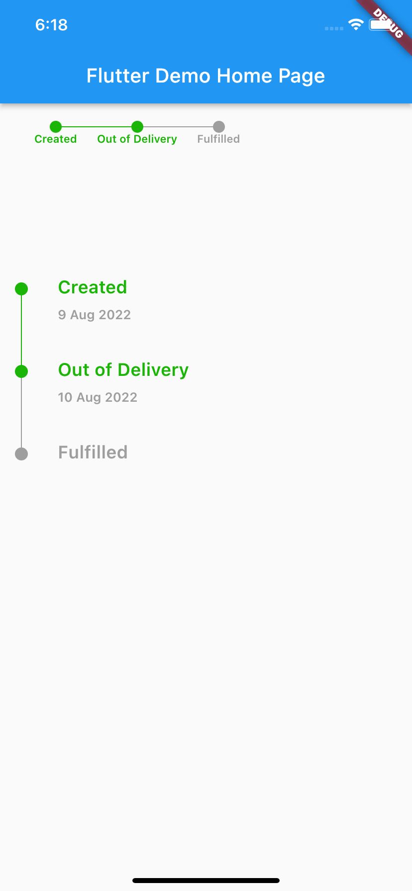

<!-- 
This README describes the package. If you publish this package to pub.dev,
this README's contents appear on the landing page for your package.

For information about how to write a good package README, see the guide for
[writing package pages](https://dart.dev/guides/libraries/writing-package-pages). 

For general information about developing packages, see the Dart guide for
[creating packages](https://dart.dev/guides/libraries/create-library-packages)
and the Flutter guide for
[developing packages and plugins](https://flutter.dev/developing-packages). 
-->

Simple tracking widget to show completed and remaining journey steps.

## Features

<br>
<p align="center">
    
</p>
<br>

## Getting started

Tracking order or journey with custom color and text styles.

## Usage

`/example` folder. 

```dart
TrackingWidget(
direction: Axis.horizontal,
itemGap: 35,
color: Colors.grey,
trackList: [  Track(isActive: true, labelText: "Created"),
Track(isActive: true, labelText: "Out of Delivery"),
Track(isActive: false, labelText: "Fulfilled"),
],
)
```

https://pub.dev/packages/steps_widget


## Additional information

Widget main class is TrackingWidget. Two type Horizontal or Vertical.
Easy to user. Just provide list and tracks for rendering the track.
